# Vue-Netease-Clound-Music-App

 基于 Vue(2.6) + vuex + vue-router + vue-axios + fastclick + better-scroll + Scss + ES6 等开发一款移动端音乐 WebApp，UI 界面参考了移动端原生App。

#### 预览图片

| 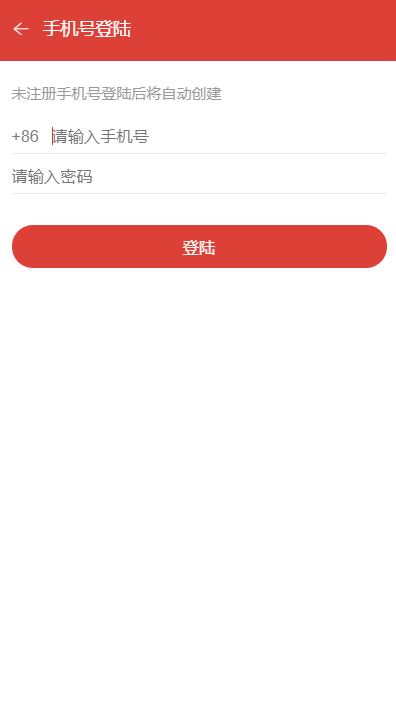 | 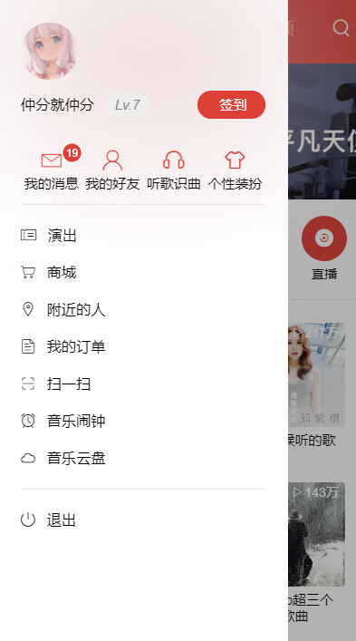  |   |
| ------------------------ | :--------------------: | ---------------------- |
| 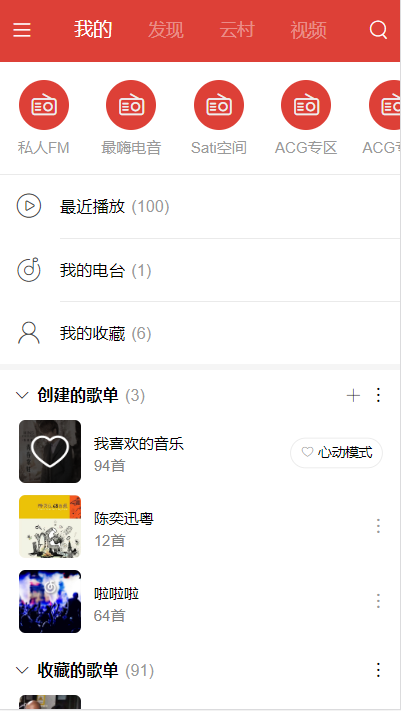    | 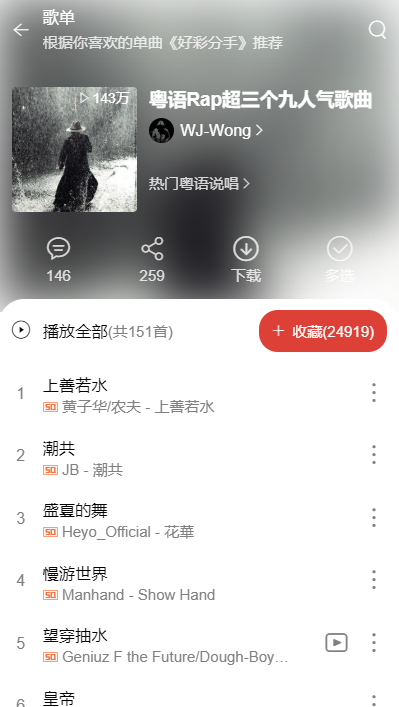  | 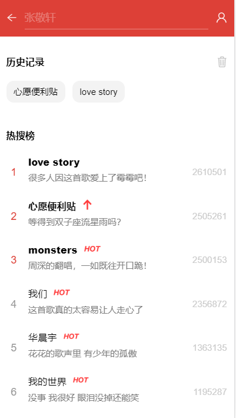  |
| 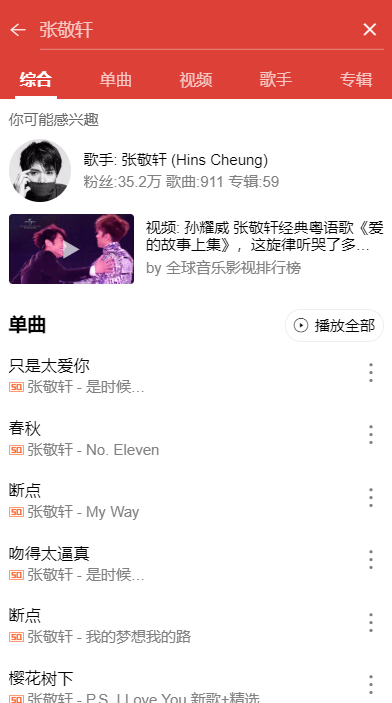    | 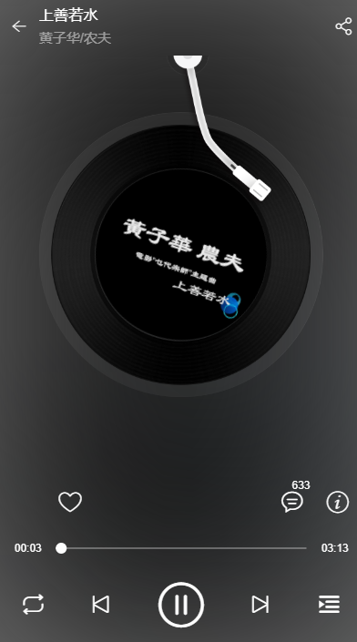  | 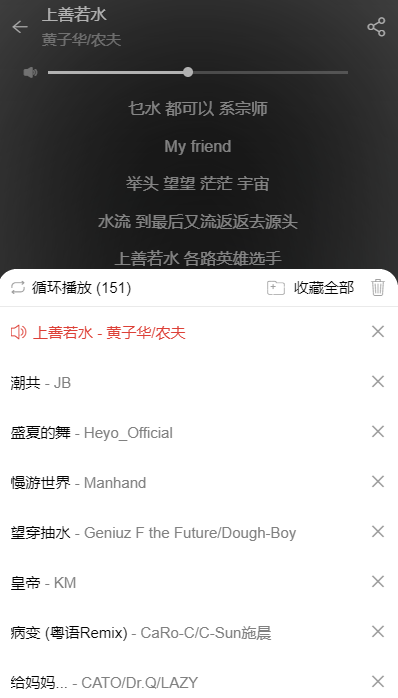  |
| 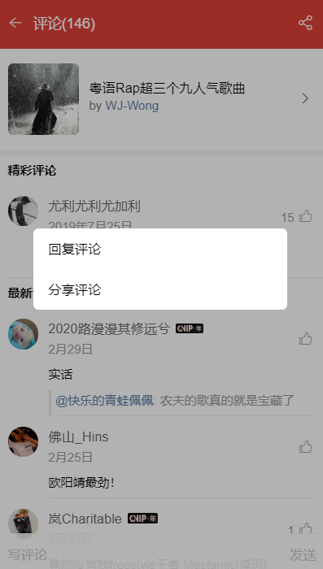    | 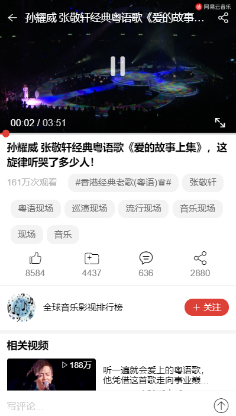 | 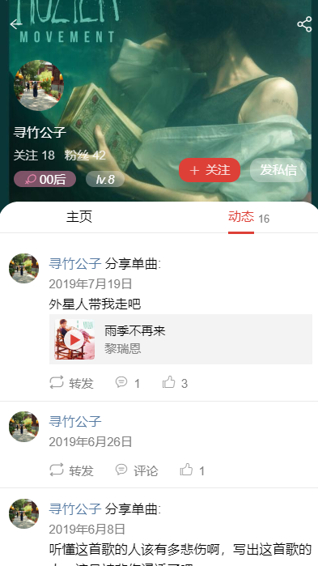 |
|    | 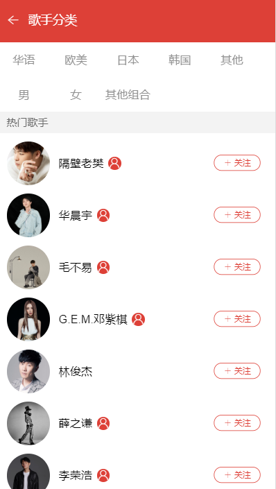 | 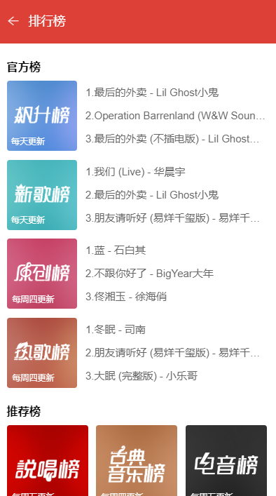 |


- 就不一一截图了，实现了很多功能，也未实现很多功能，主要还是太懒了，而且也有很多瑕疵，希望下次做的更好。如果项目帮助了你， star ⭐️ 鼓励一下吧~ 

## 感谢

- 感谢 [Binaryify](https://github.com/Binaryify) 对接口文档 [NeteaseCloudMusicApi](https://binaryify.github.io/NeteaseCloudMusicApi/#/?id=neteasecloudmusicapi) 的不断维护与更新。

## Build Setup

克隆代码到本地之后，需要运行 [NeteaseCloudMusicApi](https://binaryify.github.io/NeteaseCloudMusicApi/#/?id=neteasecloudmusicapi)，来起一个音乐的 API 接口。

如果需要在服务器上搭建的话就需要将 API 放到自己的服务器上面。

```
# install dependencies
npm install

# serve with hot reload at localhost:8080
npm run serve

# build for production with minification
npm run build
```